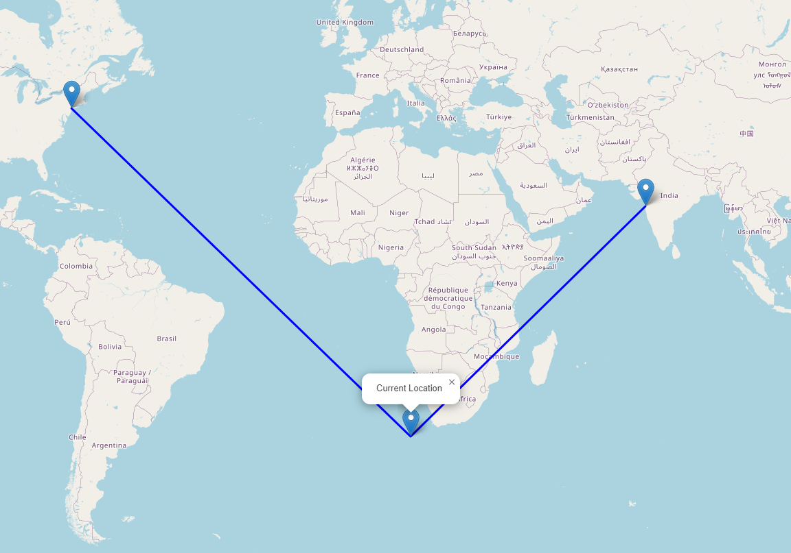

# Shipment Journey Map

This project visualizes the shipment journey on a map using the Leaflet.js library. It plots three key locations: the Start Point (Mumbai), the Current Location, and the End Point (New York) on an interactive map. The points are connected by a line to represent the shipment's progress.

## Project Structure
```
Shipment-Journey/
│
├── index.html           # Main HTML file for the project
├── script.js            # JavaScript file containing map initialization and logic
├── README.md            # Documentation for the project
└── output.png           # Output image generated by running the code
```

## How to Run the Project

1. **Clone or Download the Repository**.
   
   ```bash
   git clone https://github.com/ui-vivek/Shipment-Journey-Map.git
   cd Shipment-Journey-Map
   ```

2. **Open `index.html` in a Web Browser**.

   Simply double-click `index.html` or open it using your preferred IDE.

3. **View the Map**.
   
   The shipment journey should be displayed on the map with three markers for the Start, Current, and End points, connected by a blue line.

## Explanation of the Code

### `index.html`
This file sets up the base structure of the webpage and includes links to Leaflet.js resources:

- **CSS** and **JavaScript** are linked using a CDN.
- An HTML container `<div id="map"></div>` is provided where the map will be rendered.
- The external JavaScript file (`script.js`) is referenced at the end of the body.

### `script.js`
This script contains the main logic for rendering the map and plotting the coordinates:

- **Coordinates**:
  - `startCoordinates`: [19.0760, 72.8777] (Mumbai)
  - `currentCoordinates`: [-36.802237, 12.913736] (Midpoint Location)
  - `endCoordinates`: [40.7128, -74.0060] (New York)
  
- **Steps**:
  1. Initialize the Leaflet map centered around the Start Point.
  2. Add a tile layer using OpenStreetMap.
  3. Add markers for Start, Current, and End points.
  4. Connect the points with a blue polyline.
  5. Adjust the zoom level to fit all the points in the view.

## Dependencies
- [Leaflet.js](https://leafletjs.com/) - A JavaScript library for interactive maps.
- **OpenStreetMap** - Tile provider for the base map.

## Output
After running the project, you should see an interactive map like this:



### Features
- **Interactivity**: The map is interactive, allowing you to pan and zoom.
- **Markers**: Click on any marker to view a popup with details about that point.
- **Journey Line**: A polyline connects the three points, representing the shipment's journey.

## Potential Improvements
- Customize markers with icons for different statuses.
- Add more detailed tooltips for each point.
- Use real-time data for tracking shipments dynamically.

## License
This project is licensed under the MIT License - see the LICENSE file for details.

## Contact
For any questions or feedback, feel free to reach out to me:

- **Name**: Vivek Kumar Singh
- **Email**: [cu.vivek.1557@gmail.com](mailto:cu.vivek.1557@gmail.com)
- **LinkedIn**: [linkedin.com/in/uivivek](https://linkedin.com/in/uivivek)


---